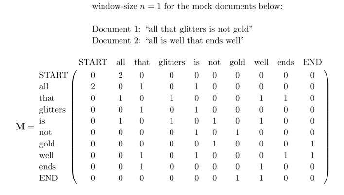
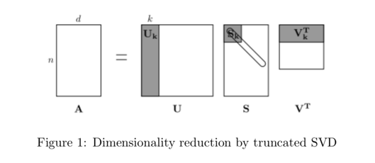

# Word-Co-occurence-Embedding-Model

In this project, we build a word embedding model using the co-occurence matrix. We first build a co-occurrence matrix `M`, which is a symmetric word-by-word matrix in which `Mij` is the number of times `wj` appears inside `wi`’s window.



Then, we run a dimensionality reduction on the matrix using Singular Value Decomposition (SVD) and select the top `k` principal components. The below figure provides a visualization of dimensionality reduction using SVD. In this picture our co-occurrence matrix is `A` with `n` rows corresponding to `n` words. We obtain a full matrix decomposition, with the singular values ordered in the diagonal `S` matrix, and our new, shorter-length-`k` word vectors in `Uk`.




- To run and obtain the embeddings
```
python run.py
```
This will compute `co-occurrence`, run `SVD` and create `co_occurence_embeddings.png`

